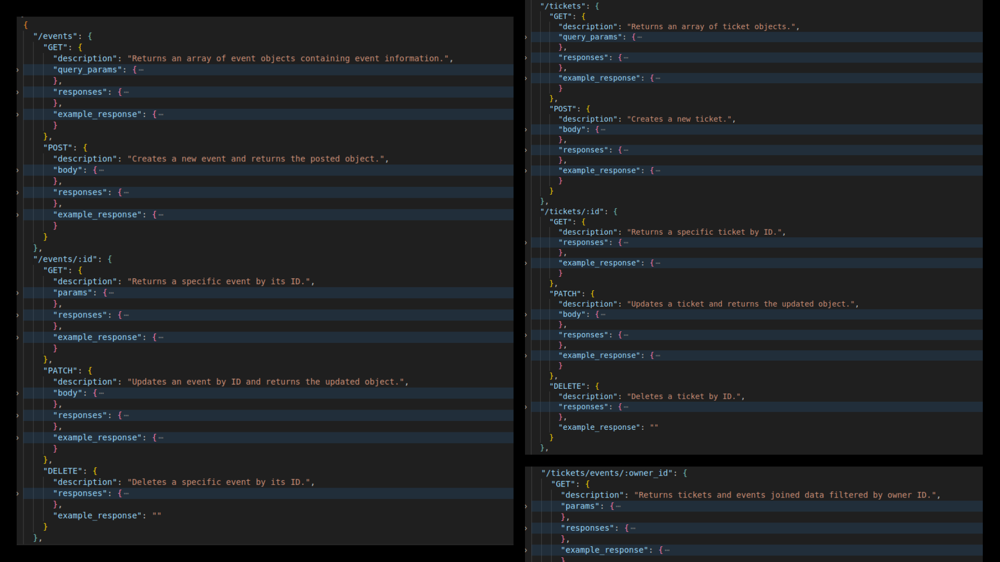

# [LocalLink BE](#)



## Summary

~~**Hosted API** [LocalLink](#)~~

This project is a RESTful API designed to manage events and tickets, providing users with Create, Read, Update, and Delete (CRUD) functionality. It utilizes Appwrite as the backend database and authentication service.

## Requirements

**Node:** v20.12.2 + <br>
**Appwrite:** Self-hosted or Cloud Instance <br>
**Docker:** Optional, for local Appwrite setup <br>

## Setup

To get started with this project, follow the steps below:

### 1. Forking the Repository

First you need to fork this repo to your GitHub account by clicking fork button near the top right of this page. If you are unfamiliar with this then please follow this GitHub [guide](https://docs.github.com/en/pull-requests/collaborating-with-pull-requests/working-with-forks/fork-a-repo).

### 2. Clone the Repository

The next step is cloning this to your local device using the following command, changing the "your-username" to your GitHub username:

```
git clone github.com/your-username/locallink-be
```

### 3. Creating your Enviroment

Once forked you will need to add a .env file in the root directory for each enviroment you wish to use.

- For testing you will need a file called ".env.test" with the name of your test database.

- For development a ".env.development" with your development database.

Inside these you will need to link your database by putting the following code inside, replacing "database_name_here" with your database name:

```
APPWRITE_PROJECT_ID=<PROJECT_ID_HERE>
APPWRITE_API_KEY=<API_KEY_HERE>
APPWRITE_ENDPOINT=<ENDPOINT_HERE>
APPWRITE_DATABASE_ID=<DATABASE_ID_HERE>
APPWRITE_EVENTS_TABLE=<EVENTS_TABLE_ID_HERE>
APPWRITE_TICKETS_TABLE=<TICKETS_TABLE_ID_HERE>
```

### 4. Install Dependencies

Now this has been done install all the npm dependencies by running the following command in your terminal/ cli:

```
npm install
```

### 5. Set Up the Database

With your enviroment variables configured and dependencies installed, you can set up the database and seed them with initial data using the following commands:

```
npm run re-seed
```

## Running the Server

For a better development experience, I recommend using **Nodemon**. This tool automatically restarts the server when code changes are detected.

### 1. Install Nodemon

If Nodemon is not installed globally, install it as a **dev dependency**:

```
npm install --save-dev nodemon
```

### 2. Start the Server

After installation, your `package.json` should contain the following scripts:


```
"scripts": {
  "start": "node server.js",
  "dev": "nodemon server.js"
}

```

To start the server in development mode, run:

```
npm run dev
```

## Challenges

- **Appwrite**  
    - This was my first time using Appwrite and NoSQL, so I had to learn  how collections, documents, and attributes work. 
    - Unlike SQL, NoSQL databases don’t use joins, so I had to find efficient ways to structure data and query relationships.

- **Docker**  
    - Since Appwrite requires Docker, I had to set up a local Appwrite instance.
    - I learned about Docker containers, volumes, and networking while troubleshooting installation issues.

